# Graphical User Interface Prototype  - CURRENT

Authors: Endri Sefa, Idri Hoxha, Mattia Oliva, Pegah Yarahmadi

Date: 26/04/23

Version: 1.0

# The application's homepage, with the register option:

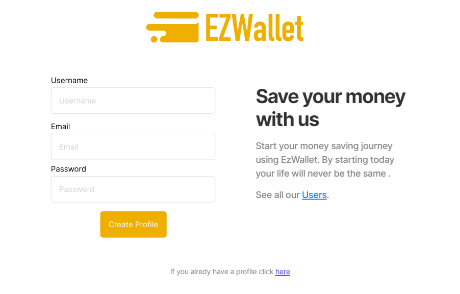

# Login:
(note: the logout option is a simple button under the user icon):

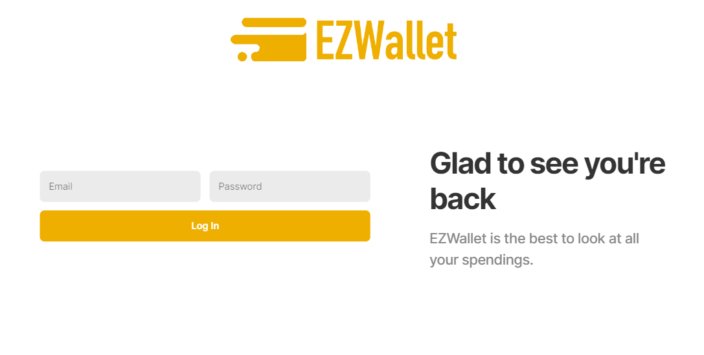

-------------------------------------------------------------------------------------------------

# Categories:

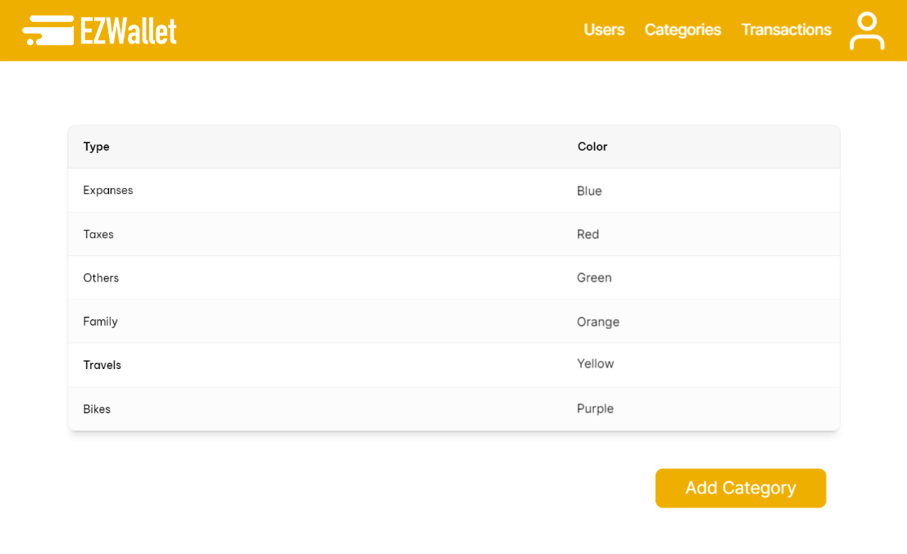

# Add Categories:

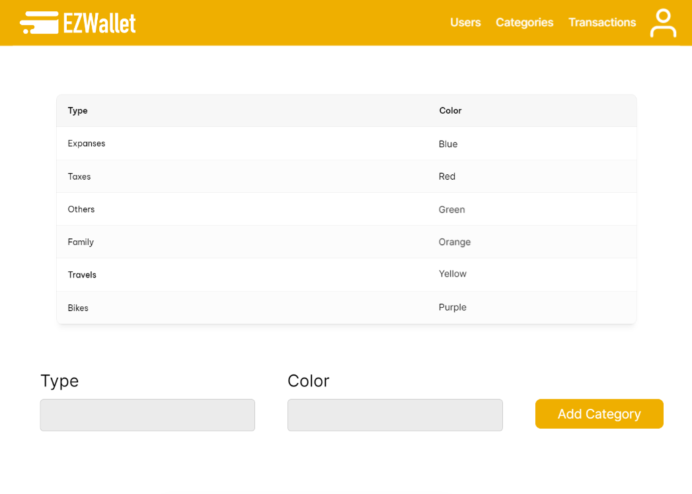

-------------------------------------------------------------------------------------------------

# Transactions:

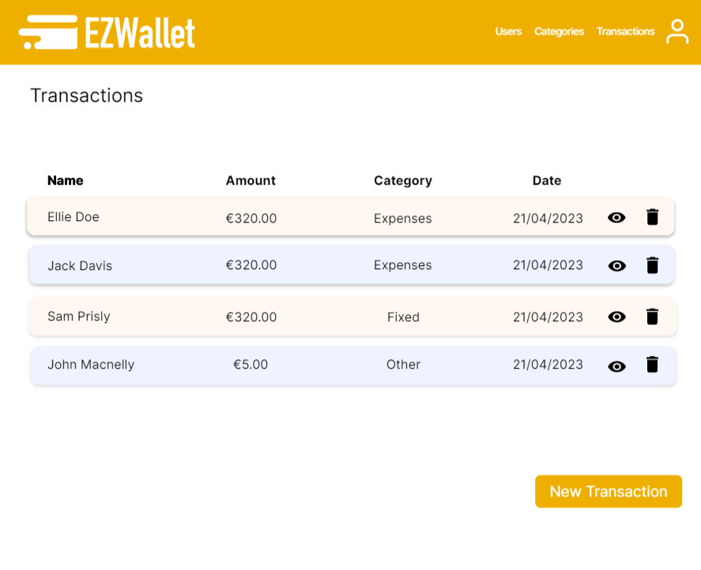

# Add Transaction:

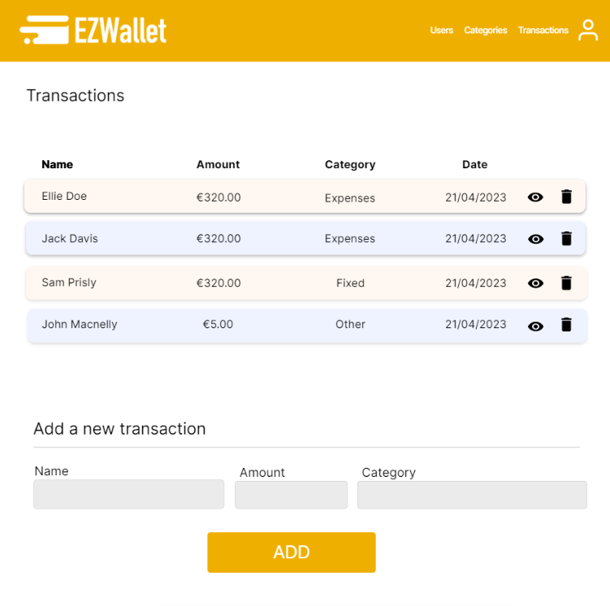

# View Transactions:

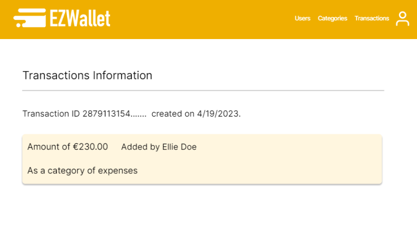

-------------------------------------------------------------------------------------------------

# Labels:
(please, note that for how the code is written, the labels doesn't actually return the color)

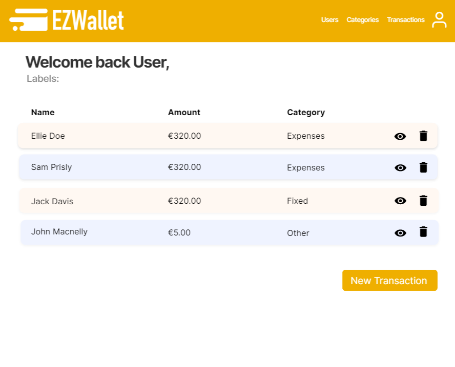

# User's profile: 
(as per V1 code, the getUserByUsername only works on the user's own username)

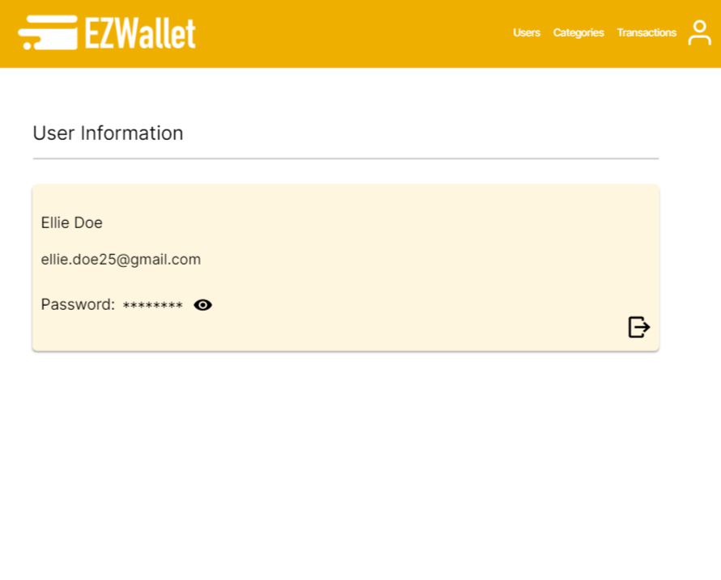

# List of users:
(can be called by unlogged users, in that case the navbar will be empty):

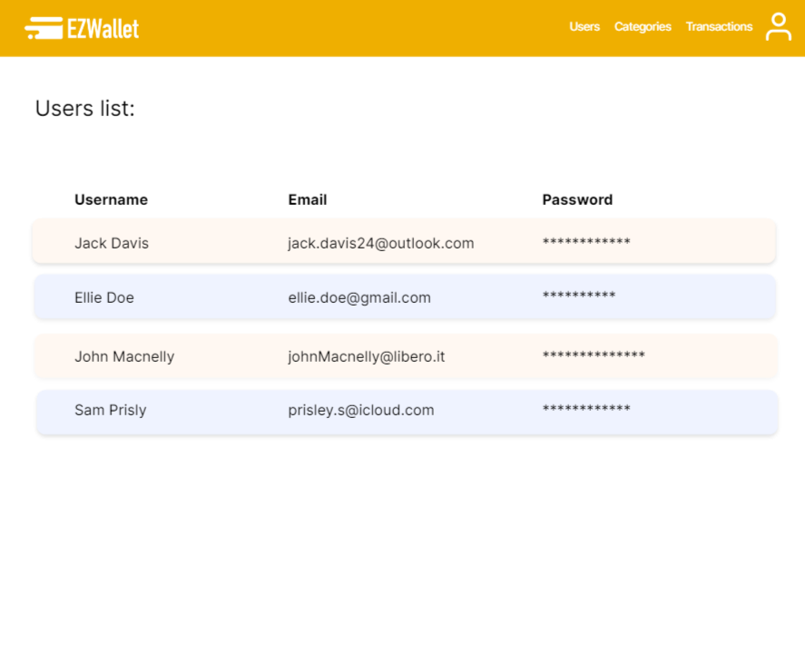

-------------------------------------------------------------------------------------------------

# Errors:
For any kind of error and exception that the application can generate, we decided to opt for a generic error
page on which will be then shown the Error code/name and a message

Generic page:

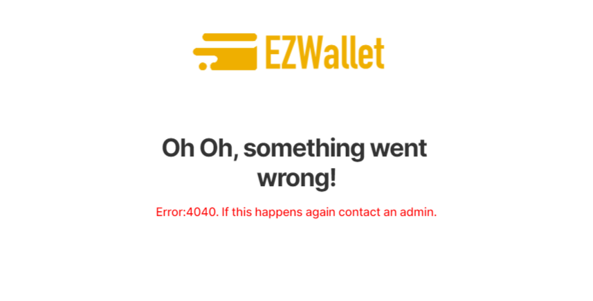

Unauthorized example:

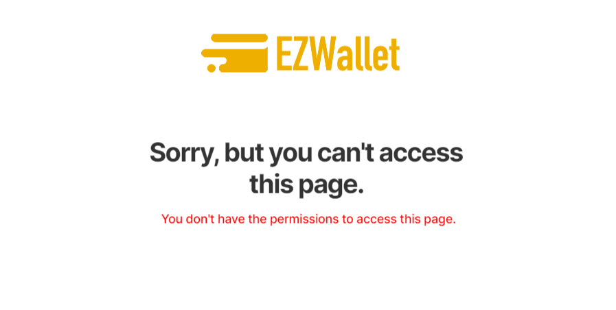

Registration needed example:

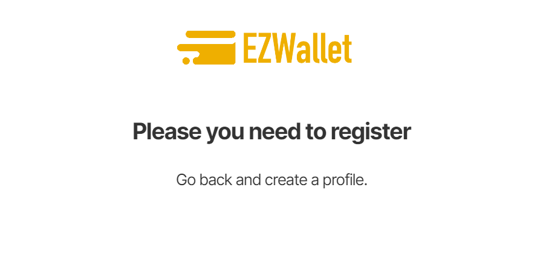

