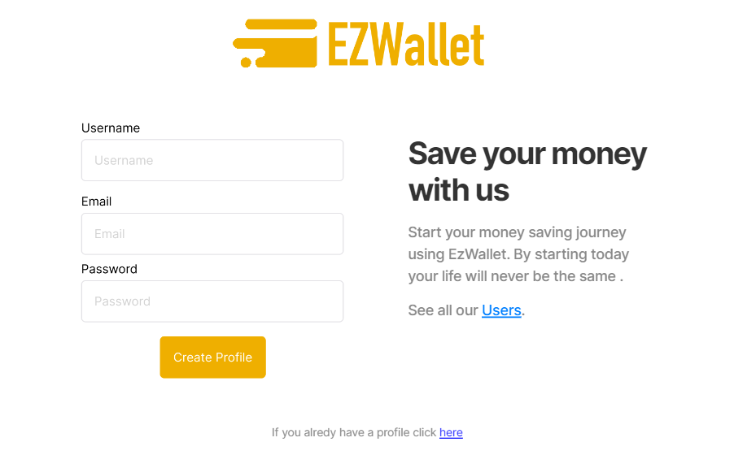
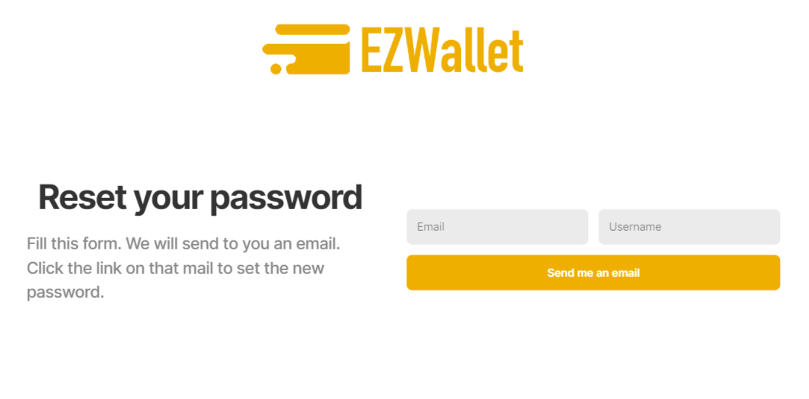
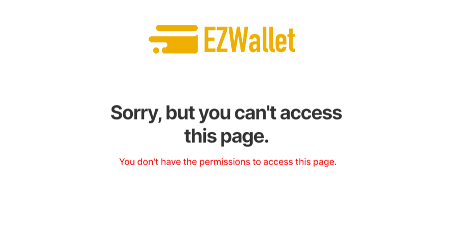
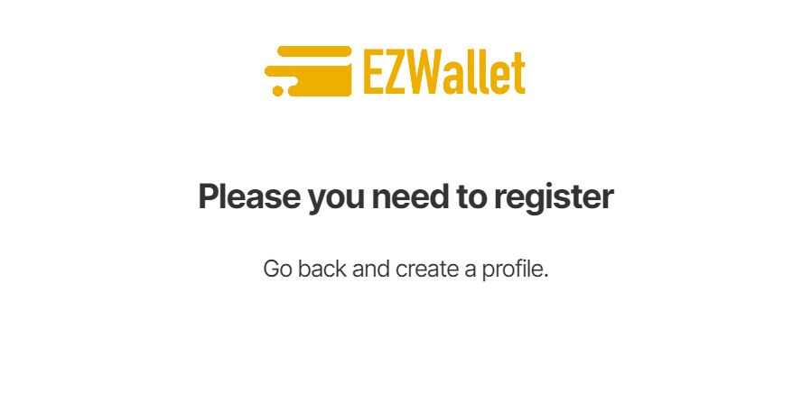

# Graphical User Interface Prototype  - FUTURE

Authors: Endri Sefa, Idri Hoxha, Mattia Oliva, Pegah Yarahmadi

Date: 26/04/23

Version: 1.0

Notice the ads on the pages 

# The application's homepage, with the register option:

------------------------------------------------------------

# Confirm Registration:

# Login:
(note: the logout option is a simple button under the user icon)

# Password reset:

The mail link leads to the following page:

------------------------------------------------------------

# Categories:

------------------------------
# Transactions:

# Add transactions

# Transaction statistics and filters

------------------------------------------------------------

# Labels:

------------------------------------------------------------
# User page:

(with the option to change password)

------------------------------------------------------------
# Users:
Users' list and search of single user, now only available for admin accounts

------------------------------------------------------------

# Errors:
For any kind of error that the application can generate, we decided to opt for a generic error
page on which will be then shown the Error code/name and a message

Generic error page: 

Unauthorized example:

Registration needed example:

