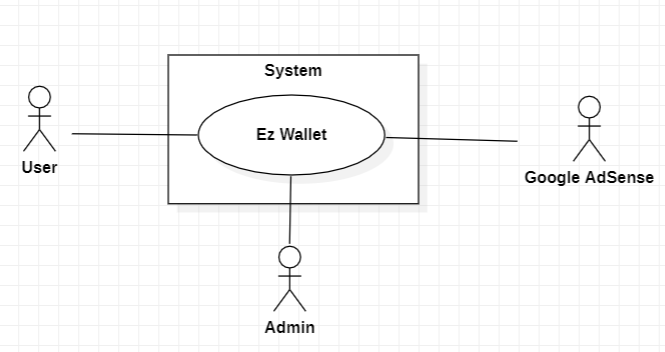
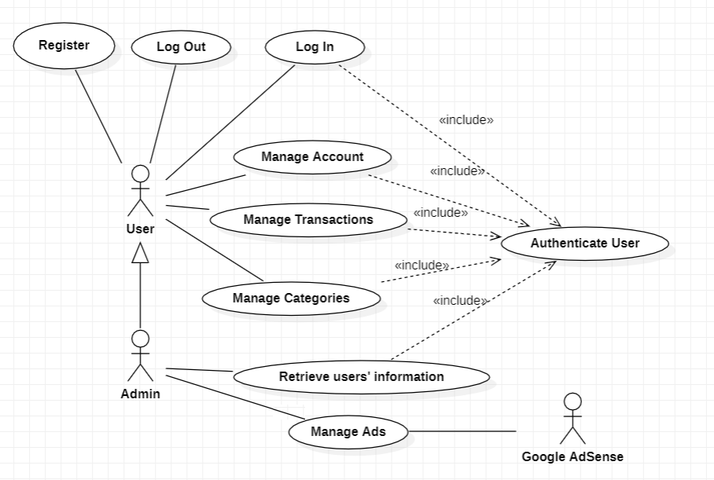
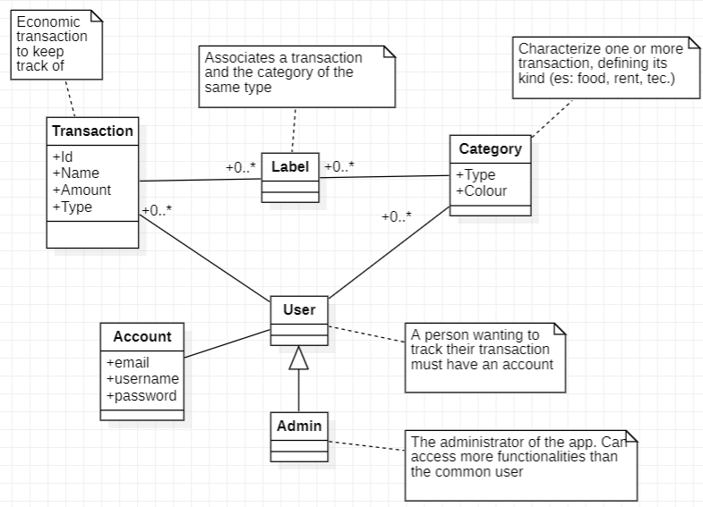
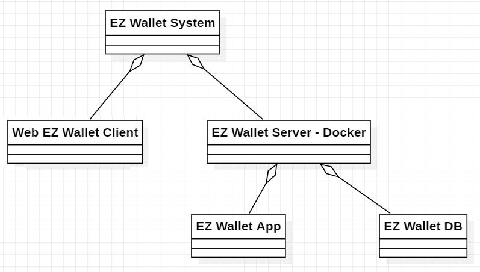
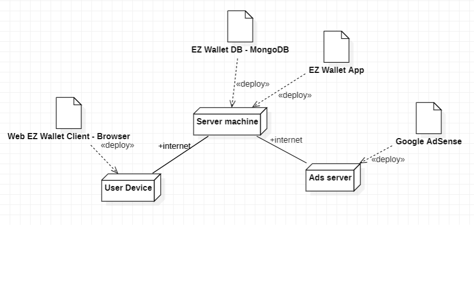

# Requirements Document - future EZWallet

Date: 26/04/23

Version: V2 - description of EZWallet in FUTURE form (as proposed by the team)

 
| Version number | Change |
| ----------------- |:-----------|
|0.1 | Inserted stakeholders, interfaces table, stories/personas, functional requirements and non functional one|
|0.2| Added all the use cases (missing the ADS management) and changed some personas|
|0.3| Added graphs, added ADS management|
|1.0| Ready to merge |

# Contents

- [Informal description](#informal-description)
- [Stakeholders](#stakeholders)
- [Context Diagram and interfaces](#context-diagram-and-interfaces)
	+ [Context Diagram](#context-diagram)
	+ [Interfaces](#interfaces) 
	
- [Stories and personas](#stories-and-personas)
- [Functional and non functional requirements](#functional-and-non-functional-requirements)
	+ [Functional Requirements](#functional-requirements)
	+ [Non functional requirements](#non-functional-requirements)
- [Use case diagram and use cases](#use-case-diagram-and-use-cases)
	+ [Use case diagram](#use-case-diagram)
	+ [Use cases](#use-cases)
    	+ [Relevant scenarios](#relevant-scenarios)
- [Glossary](#glossary)
- [System design](#system-design)
- [Deployment diagram](#deployment-diagram)

# Informal description
EZWallet (read EaSy Wallet) is a software application designed to help individuals and families keep track of their expenses. Users can enter and categorize their expenses, allowing them to quickly see where their money is going. EZWallet is a powerful tool for those looking to take control of their finances and make informed decisions about their spending.

# Stakeholders

| Stakeholder name  | Description | 
| ----------------- |:-----------:|
|  User     | Person that wants to manage their expenses or their family’s             | 
| Admin | Person managing the application and its database| 
|Google AdSense | Ads service for websites | 

The business model chosen for the application is one of **advertising revenue model**, in which the revenue comes from selling ads space on the application's website. The users don't have to pay for the service.

# Context Diagram and interfaces

## Context Diagram

## Interfaces

| Actor | Logical Interface | Physical Interface  |
| ------------- |:-------------:| -----:|
|   User     | Graphical User Interface   | Smartphone, PC|
|   Admin     | Graphical User Interface (with more functions than the one of a standard user)   | Smartphone, PC|
| Google AdSense | https://developers.google.com/adsense (API) | Internet link |

# Stories and personas

**Persona 1**: middle-class blue-collar worker, male, family man, 48yo 

**Story 1**: manages his family’s finances. Wants to keep track of different types of expenses in order to save some money for the children’s education 

**Persona 2**: full-time off-campus student, no income (parent’s allowance), female, 22yo 

**Story 2**: needs to manage the allowance from her parents, has to keep track of her spending (rent, food, university books) to avoid breaking the bank. Could be able to exploit some form of statistics to find out what costs her more

**Persona 3**: male, 27yo, freshly graduated, odd job, medium-low income, lives with parents 

**Story 3**: wants to keep track of his unnecessary spending (es: categorized as "leisure") for a while in order to save up money to move out 

**Persona 4**: female, 55yo, medium income, married with no children, really forgetful 

**Story 4**: wants to take note on spending to set something aside for retirement. Needs to retrieve her password quite often when she forgets it  

**Persona 5**: male, 16yo, student, lives with parents, does babysitting sometimes 

**Story 5**: wants to track his paychecks and money spent going out with friends to afford the new gaming console 

# Functional and non functional requirements

## Functional Requirements

| ID        | Description  |
| ------------- |:-------------:| 
|  **FR1**  | **Manage User**|
| 1.1 | Create Account |
| 1.2 | Log in |
| 1.3 | Log out| 
| 1.4 | Retrieve user| 
| 1.5 | Retrieve List of Users  |
| 1.6 | Change user password|
| 1.7 | Delete Profile |
|  **FR2**     | **Manage Transaction**   |
| 2.1 | Define transaction |
| 2.2 | Read Transactions |
| 2.3 | Delete Transaction |
| 2.4 | Filter transactions by data|
| 2.5 | Show transaction statistics by data |
| 2.6 | Get all labels|
| **FR3**  | **Manage Categories**| 
|3.1 | Define Category |
|3.2 | Read existing Categories |
|3.3 | Delete Category |
| **FR4**  | **Manage Ads**|
|4.1| Receive Ads|
|4.2| Show ads 	 |

## Non Functional Requirements

| ID        | Type (efficiency, reliability, ..)           | Description  | Refers to |
| ------------- |:-------------:| :-----:| -----:|
|  NFR1    | Security | User account should be protected by a password. User's should be able to access only their transactions and categories. No user should be able to read other user's account information such as password and email. The access (read only) of those data's should be exclusive to the admins | FR: 1.2, 1.4, 1.5, 2.2, 3.2 |
|  NFR2     | Availability  |The downtime of the server should be lower than 5h/y   | The whole application |
| NFR3 | Efficiency  |User’s functions should not require more than 1s to complete  | FR: 1.2, 1.3, 3.1, 3.3, 3.4  | 
|NFR4 | Usability | User’s interface should be easy to understand. A maximum of 10 minutes should be required for an inexperienced user to grasp the functionalities | GUI|

# Use case diagram and use cases

## Use case diagram

### Use case 1, UC1: Register
| Actors Involved        | User |
| ------------- |:-------------:| 
|  Precondition     | User has a mail address |
|  Post condition     | User has an account in the application  |
|  Nominal Scenario     | A new user inserts its mail, username and password, register itself  |
|  Variants     | - |
|  Exceptions     | The selected mail or username is already present in the user’s database, the user doesn't click on the confirmation link |

##### Scenario 1.1 

| Scenario 1.1 | |
| ------------- |:-------------:| 
|  Precondition     | User possesses an email address |
|  Post condition     | User is now registered in the application  |
| Step#        | Description  |
|  1     | User starts application (reaches website via browser)  |  
|  2     | User selects the register option  |
|  3     | User inserts mail, username and a chosen password in the respective fields, submits the data |
| 4 | System checks if an account with that mail exists |
| 5 | No existing account associated to the email is found, a confirmation email is sent to the inserted address|
| 6 | The user opens the received email and clicks on the confirmation link|
| 7 | The System registers the user's account |
##### Scenario 1.2
| Scenario 1.2 | |
| ------------- |:-------------:| 
|  Precondition     | User possesses an email address already registered in the app |
|  Post condition     | An error message is shown  |
| Step#        | Description  |
|  1     | User starts application (reaches website via browser)  |  
|  2     | User selects the register option  |
|  3     | User inserts mail, username and a chosen password in the respective fields |
| 4 | System checks if an account with that mail exists |
| 5 | An existing account is found, an error message is shown |

##### Scenario 1.3
| Scenario 1.3 | |
| ------------- |:-------------:| 
|  Precondition     | User possesses an email address already registered in the app |
|  Post condition     | - |
| Step#        | Description  |
|  1     | User starts application (reaches website via browser)  |  
|  2     | User selects the register option  |
|  3     | User inserts mail, username and a chosen password in the respective fields |
| 4 | System checks if an account with that mail exists |
| 5 | No existing account associated to the email is found, a confirmation email is sent to the inserted address|
| 6 | The user doesn't open the link within a certain amount of time |
| 7 | The System doesn't register the account, restart from step #2|

### Use case 2, UC2: Log In
| Actors Involved        | User |
| ------------- |:-------------:| 
|  Precondition     | User has an account|
|  Post condition     | User is logged in the applications |
|  Nominal Scenario     |A user inserts its mail and password to log in |
|  Variants     | - |
|  Exceptions     | The selected mail is not present in the database OR the mail exists but the password is wrong OR the user is already logged in  |
##### Scenario 2.1
| Scenario 2.1 | |
| ------------- |:-------------:| 
|  Precondition     | User has an account|
|  Post condition     | User is now logged in |
| Step#        | Description  |
|  1     | User asks to login |  
|  2     | System asks for mail and password |
|  3     | System checks, mail and password correct, user is authorized |
| 4 | User can retrieve it's information |
##### Scenario 2.2
| Scenario 2.2 | |
| ------------- |:-------------:| 
|  Precondition     | User is not yet registered |
|  Post condition     | Error message is shown |
| Step#        | Description  |
|  1     | User asks to login |  
|  2     | System asks for mail and password |
|  3     | System checks mail and password, the mail is not associated to any account|
| 4 | A message alerting "you need to register" is shown|
##### Scenario 2.3
| Scenario 2.3 | |
| ------------- |:-------------:| 
|  Precondition     | User has an account|
|  Post condition     | Error message is shown |
| Step#        | Description  |
|  1     | User asks to login |  
|  2     | System asks for mail and password |
|  3     | System checks mail and password, the password is not the one associated with the email |
| 4 | A message alerting for "wrong credentials" is shown|
##### Scenario 2.4
| Scenario 2.4 | |
| ------------- |:-------------:| 
|  Precondition     | User is already logged in |
|  Post condition     | Error message is shown |
| Step#        | Description  |
|  1     | User asks to login | 
| 2 |System detects that the user is already logged in| 
| 2 | A message alerting that the user is already logged is shown|

### Use case 3, UC3: Log Out
| Actors Involved        | User |
| ------------- |:-------------:| 
|  Precondition     | User is logged in |
|  Post condition     | User is logged out of the applications |
|  Nominal Scenario     |A logged in user logs out from the account|
|  Variants     | - |
|  Exceptions     | The user is already logged out |
##### Scenario 3.1
| Scenario 3.1 | |
| ------------- |:-------------:| 
|  Precondition     | User is logged in |
|  Post condition     | User is now logged out|
| Step#        | Description  |
|  1     | User asks to log out|  
|  2     | System logs the user out |
##### Scenario 3.2
| Scenario 3.2 | |
| ------------- |:-------------:| 
|  Precondition     | User is not logged in |
|  Post condition     | Error message is shown|
| Step#        | Description  |
|  1     | User asks to log out|  
|  2     | System shows an error message informing of the user that they're already logged out |
### Use case 4, UC4: Manage Categories
| Actors Involved        | User |
| ------------- |:-------------:| 
|  Precondition     | User is logged in |
|  Post condition     | - |
|  Nominal Scenario     |The user is able to Create, Read and Delete categories|
|  Variants     | - |
|  Exceptions     | - |
##### Scenario 4.1
| Scenario 4.1 | |
| ------------- |:-------------:| 
|  Precondition     | User is logged in |
|  Post condition     | New Category is added to user’s  |
| Step#        | Description  |
|  1     | User asks to create a new category|  
|  2     | System asks for category's data (type, colour) |
| 3 | System creates a new category associated with the user |
##### Scenario 4.2
| Scenario 4.2 | |
| ------------- |:-------------:| 
|  Precondition     | User is logged in |
|  Post condition     | User can now read all of their categories' data (type, colour) |
| Step#        | Description  |
|  1     | User asks to get categories |  
|  2     | System retrieves all the categories data |
| 3 | System shows categories to the user |
##### Scenario 4.3
| Scenario 4.3 | |
| ------------- |:-------------:| 
|  Precondition     | User is logged in |
|  Post condition     | The selected category is removed from the user's |
| Step#        | Description  |
|  1     | User selects a category to remove |  
|  2     | System removes the selected category from the user's |

### Use case 5, UC5: Manage Transaction
| Actors Involved        | User |
| ------------- |:-------------:| 
|  Precondition     | User is logged in |
|  Post condition     | - |
|  Nominal Scenario     |The user is able to Create, Read and Delete transactions, filter them, compute statistics and read the associated labels |
|  Variants     | - |
|  Exceptions     | The user is already logged out |
##### Scenario 5.1
| Scenario 5.1 | |
| ------------- |:-------------:| 
|  Precondition     | User is logged in |
|  Post condition     | New Transaction is added to user’s transaction  |
| Step#        | Description  |
|  1     | User asks to create a new transaction |  
|  2     | System asks for transaction data (name, amount, type, data) |
| 3 | System creates a new Transaction associated with the user |
##### Scenario 5.2
| Scenario 5.2 | |
| ------------- |:-------------:| 
|  Precondition     | User is logged in |
|  Post condition     |User can read all of his transactions' data (name, amount, type) |
| Step#        | Description  |
|  1     | User asks to read their transactions |  
|  2     | System retrieves the user’s transactions and shows them to the user |
##### Scenario 5.3
| Scenario 5.3 | |
| ------------- |:-------------:| 
|  Precondition     | User is logged in |
|  Post condition     |Removed transaction no longer present in user’s |
| Step#        | Description  |
|  1     | User asks to delete a transaction  |  
|  2     | System asks for transaction id |
| 3 | System removes transaction from user’s transaction list |
##### Scenario 5.4
| Scenario 5.4 | |
| ------------- |:-------------:| 
|  Precondition     | User is logged in |
|  Post condition     |User can read their labels (transaction + category of same type) |
| Step#        | Description  |
|  1     | User asks to read labels |  
|  2     | System retrieves transaction and their categories |
| 3 | System shows labels to user |
##### Scenario 5.5
| Scenario 5.5 | |
| ------------- |:-------------:| 
|  Precondition     | User is logged in |
|  Post condition     |Only transactions passing the filter are shown |
| Step#        | Description  |
|  1     | User selects a filter type among the transactions' attributes |
| 2 |   User inserts the filter value |
|  3    | System retrieves transaction, among the user's, passing the filter |
| 4 | System shows the filtered transactions |
##### Scenario 5.6
| Scenario 5.6 | |
| ------------- |:-------------:| 
|  Precondition     | User is logged in |
|  Post condition     |Only transactions passing the filter are shown |
| Step#        | Description  |
|  1     | User selects one or more types among the transactions' attributes |
| 2 |   The system computes the transaction statistics on the selected attributes |
|  3    | System graphically shows the resulting statistics (on a cartesian plane using the selected attributes as axis) |
### Use case 6, UC6: Manage User's Accounts
| Actors Involved        | User, Admin |
| ------------- |:-------------:| 
|  Precondition     | The Admin is logged in |
|  Post condition     | - |
|  Nominal Scenario     |The Admin is able to read the list of user's accounts information or search a single user's information by the username. The users can change their password and delete their profiles|
|  Variants     | - |
|  Exceptions     | There's no account with the selected username, there is no account associated to the inserted mail |
##### Scenario 6.1
| Scenario 6.1 | |
| ------------- |:-------------:| 
|  Precondition     | Admin is logged in |
|  Post condition     | A certain user's account information are available to the admin  |
| Step#        | Description  |
|  1     | Admin inserts username to search |  
|  2     | System finds the user's information |
| 3 | System displays the user's information |
##### Scenario 6.2
| Scenario 6.2 | |
| ------------- |:-------------:| 
|  Precondition     | Admin is logged in |
|  Post condition     | An error message is shown|
| Step#        | Description  |
|  1     | Admin inserts username to search |  
|  2     | System doesn't find any user with that username |
| 3 | System displays an error message |
##### Scenario 6.3
| Scenario 6.3 | |
| ------------- |:-------------:| 
|  Precondition     | Admin is logged in |
|  Post condition     | All the users' information are available to the admin |
| Step#        | Description  |
|  1     | User asks to retrieve all the user's account information |  
|  2     | System retrieves the accounts data list |
|3 | System displays the list |
##### Scenario 6.4
| Scenario 6.4 | User |
| ------------- |:-------------:| 
|  Precondition     | User is registered |
|  Post condition     | A new password is associated to the account  |
| Step#        | Description  |
|  1     | User says that they've forgot the password at the login |  
|  2     | User inserts their email |
| 3 | System checks if the email is associated to an account |
| 4 | System finds the account, sends an email with a link to change password to the inserted address |
| 5 | Use opens the email, click on recovery link|
| 6 | User inserts a new password for the account |
| 7 | System replace the old password with the new one |
##### Scenario 6.5
| Scenario 6.5 | User |
| ------------- |:-------------:| 
|  Precondition     | - |
|  Post condition     | An error message is shown |
| Step#        | Description  |
|  1     | User says that they've forgot the password at the login |  
|  2     | User inserts their email |
| 3 | System checks if the email is associated to an account |
| 4 | System doesn't find any account associated to the email, an error message is shown |
| 5 | Use opens the email, click on recovery link|
| 6 | User inserts a new password for the account |
| 7 | System replace the old password with the new one |
##### Scenario 6.6
| Scenario 6.6 | User |
| ------------- |:-------------:| 
|  Precondition     | User is logged in |
|  Post condition     | A new password is associated to the account  |
| Step#        | Description  |
|  1     | User selects the option to change password |  
|2 | System asks for the new password |
| 3 | User inserts a new password for the account |
| 4 | System replace the old password with the new one |
##### Scenario 6.7
| Scenario 6.7 | User |
| ------------- |:-------------:| 
|  Precondition     | User is logged in |
|  Post condition     | The user's account is removed from the system |
| Step#        | Description  |
|  1     | User selects the option to remove the account |  
|2 | System informs the user the operation is irreversible |
|3 | System requires the user to insert the password |
| 3 | User inserts the password |
| 4 | System removes the account data and return the user to the home page |

### Use case 7, UC7: Manage Ads
| Actors Involved        | Admin, Google ADSense |
| ------------- |:-------------:| 
|  Precondition     | - |
|  Post condition     | The ads are now showing in the app |
|  Nominal Scenario     | The admin can place the ads using the AdSense Service. An user logging in triggers the AdSense to show them the adds|
|  Variants     | - |
|  Exceptions     | - |
##### Scenario 7.1
| Scenario 7.1  | Admin, Google ADSense |
| ------------- |:-------------:| 
|  Precondition     |Admin is logged in |
|  Post condition     | Ads can now be shown |
| Step#        | Description  |
| 1 | Admins can place on the various pages the banner for the service |
| 2 | The Ads service allows the admin to select certain types of ads to be shown in the banners|

##### Scenario 7.2
| Scenario 7.2  | User, Google ADSense |
| ------------- |:-------------:| 
|  Precondition     |- |
|  Post condition     | Ads shows in the app  |
| Step#        | Description  |
| 1 | User logs in |
| 2 | System calls the AdSense service passing the user's information|
| 3 | The service returns the targeted ads to the System|
| 4 | System shows the ads to the user|

# Glossary

# System Design

# Deployment Diagram 

