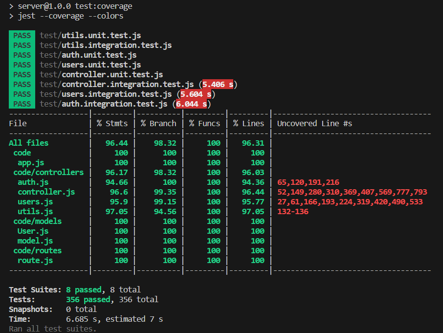
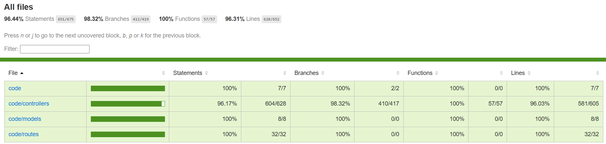

# Test Report

<The goal of this document is to explain how the application was tested, detailing how the test cases were defined and what they cover>

# Contents

- [Dependency graph](#dependency-graph)

- [Integration approach](#integration-approach)

- [Tests](#tests)

- [Coverage](#Coverage)

# Dependency graph 

   

# Integration approach

   **Mixed**: we started with unit testing for some modules, then proceeded with the integration of the modules for which we had finished the unit testing. This lead to the writing in parallel of some units and some intregration testing
   * step1: unit (transactions, utils)
   * step2: integration (utils) unit (categories)
   * step3: integration (utils + categories)
   * step4: integration (utils + transactions) unit (groups + users)
   * step5: integration (utils + categories +transactions)
   * step6: integration (utils + users)
   * step7: integration (utils + groups)
   * step8: integration (utils + categories + transactions + users)
   * step9: integration (all) 

# Tests

   <in the table below list the test cases defined For each test report the object tested, the test level (API, integration, unit) and the technique used to define the test case  (BB/ eq partitioning, BB/ boundary, WB/ statement coverage, etc)>   <split the table if needed>

| Test case name     | Object(s) tested  | Test level | Technique used |
| :------------- |:-------------|:--|:--|
|  401 - Unathorized access    | createCategory | unit | WB - statement coverage |
|  400 - Empty - invalid value parameters    | createCategory | unit | WB - statement coverage |
|  400 - A category of this type is already present    | createCategory | unit | WB - statement coverage |
|  200 - Category created successfully    | createCategory | unit | WB - statement coverage |
|  401 - Unathorized access | updateCategory | unit | WB - statement coverage |
|  400 - Empty values | updateCategory | unit | WB - statement coverage |
|  400 - Missing values | updateCategory | unit | WB - statement coverage |
|  400 - New type belongs to another category | updateCategory | unit | WB - statement coverage |
|  400 - Category does not exist | updateCategory | unit | WB - statement coverage |
|  200 - Category updated successfully (changed also the type) | updateCategory | unit |WB - statement coverage |
|  200 - Category updated successfully (changed only the color) | updateCategory | unit | WB - statement coverage |
|401 - Unathorized access|deleteCategory|unit|WB - statement coverage|
|400 - Missing array of types|deleteCategory|unit|WB - statement coverage|
|400 - Empty array of types|deleteCategory|unit|WB - statement coverage|
|400 - Category with empty type to be deleted|deleteCategory|unit|WB - statement coverage|
|400 - Category of this type does not exist|deleteCategory|unit|WB - statement coverage|
|400 - Trying to delete the only available category|deleteCategory|unit|WB - statement coverage|
|200 - Category deleted successfully (N>T)|deleteCategory|unit|WB - statement coverage|
|200 - Category deleted successfully (N = T)|deleteCategory|unit|WB - statement coverage|
|401 - Unathorized access|getCategories|unit|WB - statement coverage|
|200 - Returns list of all categories|getCategories|unit|WB - statement coverage|
|200 - Returns retrieve empty list (no categories)|getCategories|unit|WB - statement coverage|
|401 - Unathorized access|createTransaction|unit|WB - statement coverage|
|400 - missing or empty body parameter|createTransaction|unit|WB - statement coverage|
|400 - Amount cannot be parsed|createTransaction|unit|WB - statement coverage|
|400 - User param and body mismatch|createTransaction|unit|WB - statement coverage|
|400 - User not found|createTransaction|unit|WB - statement coverage|
|400 - Category not found|createTransaction|unit|WB - statement coverage|
|200 - Transaction correctly inserted|createTransaction|unit|WB - statement coverage|
|401 - Unathorized access|getAllTransactions|unit|WB - statement coverage|
|200 - Should find multiple transactions|getAllTransactions|unit|WB - statement coverage|
|200 - Should find empty list if no transactions are present|getAllTransactions|unit|WB - statement coverage|
|401 - Unathorized access - User|getTransactionsByUser|unit|WB - statement coverage|
|401 - Unathorized access - Admin|getTransactionsByUser|unit|WB - statement coverage|
|400 - User not found|getTransactionsByUser|unit|WB - statement coverage|
|200 - Should find multiple transactions for testuser|getTransactionsByUser|unit|WB - statement coverage|
|200 - Should return empty array because user has no transactions|getTransactionsByUser|unit|WB - statement coverage|
|401 - Unathorized access - User|getTransactionsByUserByCategory|unit|WB - statement coverage|
|401 - Unathorized access - Admin|getTransactionsByUserByCategory|unit|WB - statement coverage|
|400 - User not found|getTransactionsByUserByCategory|unit|WB - statement coverage|
|400 - Category not found|getTransactionsByUserByCategory|unit|WB - statement coverage|
|200 - Should find multiple transactions for testuser|getTransactionsByUserByCategory|unit|WB - statement coverage|
|200 - Should return empty array because user has no transactions/no transaction with such category|getTransactionsByUserByCategory|unit|WB - statement coverage|
|400 - not an existing group|getTransactionsByGroup|unit|WB - statement coverage|
|401 - Unathorized access - User not part of group|getTransactionsByGroup|unit|WB - statement coverage|
|401 - Unathorized access - Admin|getTransactionsByGroup|unit|WB - statement coverage|
|200 - Should find a transactions for each user in group|getTransactionsByGroup|unit|WB - statement coverage|
|200 - Should find a transactions for each user in group, but a user has no transactions|getTransactionsByGroup|unit|WB - statement coverage|
|200 - Should return an empty array, because no user has any transactions|getTransactionsByGroup|unit|WB - statement coverage|
|401 - Unathorized access - User not part of group|getTransactionsByGroupByCategory|unit|WB - statement coverage|
|401 - Unathorized access - Admin|getTransactionsByGroupByCategory|unit|WB - statement coverage|
|400 - not an existing group|getTransactionsByGroupByCategory|unit|WB - statement coverage|
|400 - not an existing category|getTransactionsByGroupByCategory|unit|WB - statement coverage|
|200 - Should find a single transactions for each user in group even thought some has more than one|getTransactionsByGroupByCategory|unit|WB - statement coverage|
|200 - Should find a transactions for each user in group, except for one who has no trans of that cat|getTransactionsByGroupByCategory|unit|WB - statement coverage|
|200 - Should return an empty array, because no user has any transaction of that category|getTransactionsByGroupByCategory|unit|WB - statement coverage|
|401 - Unathorized access|deleteTransaction|unit|WB - statement coverage|
|400 - User not found|deleteTransaction|unit|WB - statement coverage|
|400 - missing id in body|deleteTransaction|unit|WB - statement coverage|
|400 - empty id in body|deleteTransaction|unit|WB - statement coverage|
|400 - no such transaction for this user|deleteTransaction|unit|WB - statement coverage|
|400 - unable to delete transaction|deleteTransaction|unit|WB - statement coverage|
|200 - Transaction succesfully deleted|deleteTransaction|unit|WB - statement coverage|
|401 - Unathorized access|deleteTransactions|unit|WB - statement coverage|
|400 - missing ids in body|deleteTransactions|unit|WB - statement coverage|
|400 - ids cannot be empty|deleteTransactions|unit|WB - statement coverage|
|400 - one or more transactions are not present|deleteTransactions|unit|WB - statement coverage|
|200 - Transactions succesfully deleted|deleteTransactions|unit|WB - statement coverage|
|401 - Admin authentication failed|getUsers|unit|WB - statement coverage|
|200 - Returns empty list if there are no users|getUsers|unit|WB - statement coverage|
|200 - Returns list of all users|getUsers|unit|WB - statement coverage|
|200 - Returns user data for authenticated user requests|getUser|unit|WB - statement coverage|
|200 - Returns user data for authenticated admin requests|getUser|unit|WB - statement coverage|
|400 - If user is not found|getUser|unit|WB - statement coverage|
|400 - If user is not found as admin|getUser|unit|WB - statement coverage|
|401 - If request is not authenticated|getUser|unit|WB - statement coverage|
|401 - Unauthorized access|createGroup|unit|WB - statement coverage|
|400 - Missing name|createGroup|unit|WB - statement coverage|
|400 - Empty name|createGroup|unit|WB - statement coverage|
|400 - Empty parameters|createGroup|unit|WB - statement coverage|
|400 - Group name already used|createGroup|unit|WB - statement coverage|
|400 - User calling is already in a group|createGroup|unit|WB - statement coverage|
|400 - One or more mails are empty strings|createGroup|unit|WB - statement coverage|
|400 - One or more mails are not in a valid format|createGroup|unit|WB - statement coverage|
|400 - All users already in group or do not exist|createGroup|unit|WB - statement coverage|
|200 - Group created correctly|createGroup|unit|WB - statement coverage|
|200 - Group created correctly and user auto insertion|createGroup|unit|WB - statement coverage|
|401 - Unauthorized access|getGroups|unit|WB - statement coverage|
|200 - Admin gets all groups|getGroups|unit|WB - statement coverage|
|200 - Admin gets []: no group exists|getGroups|unit|WB - statement coverage|
|401 - unauthorized access|getGroup|unit|WB - statement coverage|
|400 - The group does not exist|getGroup|unit|WB - statement coverage|
|200 - Returns the required group|getGroup|unit|WB - statement coverage|
|400 - The group does not exist|addToGroup|unit|WB - statement coverage|
|401 - unauthorized acces to admin route|addToGroup|unit|WB - statement coverage|
|401 - unauthorized acces to user route|addToGroup|unit|WB - statement coverage|
|400 - missing body attributes|addToGroup|unit|WB - statement coverage|
|400 - emails cannot be empty|addToGroup|unit|WB - statement coverage|
|400 - wrong email format|addToGroup|unit|WB - statement coverage|
|400 - all users already in a group or not existing|addToGroup|unit|WB - statement coverage|
|200 - Successfully inserted|addToGroup|unit|WB - statement coverage|
|401 - unauthorized acces to admin route|removeFromGroup|unit|WB - statement coverage|
|401 - unauthorized acces to user route|removeFromGroup|unit|WB - statement coverage|
|400 - The group does not exist|removeFromGroup|unit|WB - statement coverage|
|400 - missing body attributes|removeFromGroup|unit|WB - statement coverage|
|400 - emails cannot be empty|removeFromGroup|unit|WB - statement coverage|
|400 - wrong email format|removeFromGroup|unit|WB - statement coverage|
|400 - all users already in a group or not existing|removeFromGroup|unit|WB - statement coverage|
|400 - only one member|removeFromGroup|unit|WB - statement coverage|
|200 - Successfully deleted members|removeFromGroup|unit|WB - statement coverage|
|200 - Successfully deleted members - keep the first because #members == #emails|removeFromGroup|unit|WB - statement coverage|
|200 - delete a user and return the number of deleted transactions and whether the user was deleted from a group|deleteUser|unit|WB - statement coverage|
|400 - cannot delete admin error|deleteUser|unit|WB - statement coverage|
|400 - user not found|deleteUser|unit|WB - statement coverage|
|401 - if request is not authenticated|deleteUser|unit|WB - statement coverage|
|400 - if email is not provided|deleteUser|unit|WB - statement coverage|
|400 - if email format is invalid|deleteUser|unit|WB - statement coverage|
|400 - if email format is empty string|deleteUser|unit|WB - statement coverage|
|401 - unauthorized access - not an Admin|deleteGroup|unit|WB - statement coverage|
|400 - Admin did not insert all necessary data|deleteGroup|unit|WB - statement coverage|
|400 - Admin insert an empty string as a name|deleteGroup|unit|WB - statement coverage|
|400 - Admin inserts the name of a group that does not exist|deleteGroup|unit|WB - statement coverage|
|200 - The group is deleted by the admin|deleteGroup|unit|WB - statement coverage|
|200 - Should successfully register|register|unit|WB - statement coverage|
|400 - Username not defined|register|unit|WB - statement coverage|
|400 - Email not defined|register|unit|WB - statement coverage|
|400 - Password not defined|register|unit|WB - statement coverage|
|400 - Username empty string|register|unit|WB - statement coverage|
|400 - Email empty string|register|unit|WB - statement coverage|
|400 - Password empty string|register|unit|WB - statement coverage|
|400 - Email invalid format|register|unit|WB - statement coverage|
|400 - Email/Username already registered|register|unit|WB - statement coverage|
|400 - email already used by another person|register|unit|WB - statement coverage|
|200 - Should successfully register the admin|registerAdmin|unit|WB - statement coverage|
|400 - Username not defined|registerAdmin|unit|WB - statement coverage|
|400 - Email not defined|registerAdmin|unit|WB - statement coverage|
|400 - Password not defined|registerAdmin|unit|WB - statement coverage|
|400 - Username empty string|registerAdmin|unit|WB - statement coverage|
|400 - Email empty string|registerAdmin|unit|WB - statement coverage|
|400 - password empty string|registerAdmin|unit|WB - statement coverage|
|400 - Email invalid format|registerAdmin|unit|WB - statement coverage|
|400 - Email/Username already registered|registerAdmin|unit|WB - statement coverage|
|400 - Email already used by another person|registerAdmin|unit|WB - statement coverage|
|400 - Email or password is missing|login|unit|WB - statement coverage|
|400 - Email or password is empty string|login|unit|WB - statement coverage|
|400 - Email is in an invalid format|login|unit|WB - statement coverage|
|400 - User does not exist|login|unit|WB - statement coverage|
|400 - Password is incorrect|login|unit|WB - statement coverage|
|200 - Login successfully with valid credentials|login|unit|WB - statement coverage|
|400 - No refresh token|logout|unit|WB - statement coverage|
|400 - User not found|logout|unit|WB - statement coverage|
|200 - User logged out successfully|logout|unit|WB - statement coverage|
|Success case: authorized|verifyAuth|unit|WB - statement coverage|
|User authentication : unauthorized|verifyAuth|unit|WB - statement coverage|
|User authentication - access token missing parameters|verifyAuth|unit|WB - statement coverage|
|User authentication - refresh token missing parameters|verifyAuth|unit|WB - statement coverage|
|Parameters of refresh token and access token do not match|verifyAuth|unit|WB - statement coverage|
|Admin authentication failed role not admin|verifyAuth|unit|WB - statement coverage|
|Admin success case|verifyAuth|unit|WB - statement coverage|
|Get user failed, user can only retrieve info about himself|verifyAuth|unit|WB - statement coverage|
|User auth success|verifyAuth|unit|WB - statement coverage|
|Group auth failed email not included|verifyAuth|unit|WB - statement coverage|
|Group auth success|verifyAuth|unit|WB - statement coverage|
|Accesstoken and refreshtoken expired|verifyAuth|unit|WB - statement coverage|
|AccessToken has been refreshed|verifyAuth|unit|WB - statement coverage|
|Should return an empty obj when no params are passed|handleDateFilterParams|unit|WB - statement coverage|
|Should throw an error when date and form/upto are both used|handleDateFilterParams|unit|WB - statement coverage|
|Should throw an error when using a wrong date format|handleDateFilterParams|unit|WB - statement coverage|
|Should return an close interval using both from and upto|handleDateFilterParams|unit|WB - statement coverage|
|Should return a right-open interval using only from|handleDateFilterParams|unit|WB - statement coverage|
|Should return a left-open interval using only upto|handleDateFilterParams|unit|WB - statement coverage|
|Should return a close interval using only date|handleDateFilterParams|unit|WB - statement coverage|
|Should return an empty obj when no params are passed|handleAmountFilterParams|unit|WB - statement coverage|
|Should throw an error when one or both parameters are not parseable to int|handleAmountFilterParams|unit|WB - statement coverage|
|Should return an close interval using both min and max|handleAmountFilterParams|unit|WB - statement coverage|
|Should return a right-open interval using only min|handleAmountFilterParams|unit|WB - statement coverage|
|Should return a left-open interval using only max|handleAmountFilterParams|unit|WB - statement coverage|
|---------------------------------------------------|
|Returns 400: attribute missing|register|integration, API (database APIs)|Functional|
|Returns 400: attributes cannot be empty string|register|integration, API (database APIs)|Functional|
|Returns 400: invalid mail format|register|integration, API (database APIs)|Functional|
|Returns 400: email already taken|register|integration, API (database APIs)|Functional|
|Returns 400: username already taken|register|integration, API (database APIs)|Functional|
|Returns 200: create a new user|register|integration, API (database APIs)|Functional|
|Returns 400: attribute missing|registerAdmin|integration, API (database APIs)|Functional|
|Returns 400: attributes cannot be empty string|registerAdmin|integration, API (database APIs)|Functional|
|Returns 400: invalid mail format|registerAdmin|integration, API (database APIs)|Functional|
|Returns 400: Email already taken|registerAdmin|integration, API (database APIs)|Functional|
|Returns 400: username already taken|registerAdmin|integration, API (database APIs)|Functional|
|Returns 200: create a new admin|registerAdmin|integration, API (database APIs)|Functional|
|Returns 400: attribute missing|login|integration, API (database APIs)|Functional|
|Returns 400: attributes cannot be empty string|login|integration, API (database APIs)|Functional|
|Returns 400: invalid mail format|login|integration, API (database APIs)|Functional|
|Returns 400: user is not registred|login|integration, API (database APIs)|Functional|
|Returns 400: wrong credentials|login|integration, API (database APIs)|Functional|
|Returns 200: login|login|integration, API (database APIs)|Functional|
|Returns 400: unsuccessfull log out case, refresh token not found|logout|integration, API (database APIs)|Functional|
|Returns 400: unsuccessfull log out case, user not found|logout|integration, API (database APIs)|Functional|
|Returns 400: unsuccessfull log out case, user not found|logout|integration, API (database APIs)|Functional|
|Returns 200: successfull logout case|logout|integration, API (database APIs)|Functional|
|Returns 401: because the calling user is not an admin|createCategory|integration, API (database APIs)|Functional|
|Returns 400: because one or more params are missing|createCategory|integration, API (database APIs)|Functional|
|Returns 400: because one or more params are empty strings|createCategory|integration, API (database APIs)|Functional|
|Returns 400: because the type passed is one of an already existing category|createCategory|integration, API (database APIs)|Functional|
|Returns 200: the correctly inserted category|createCategory|integration, API (database APIs)|Functional|
|Returns 401: because the calling user is not an admin|updateCategory|integration, API (database APIs)|Functional|
|Returns 400: because the request body does not contain all the requested attributes|updateCategory|integration, API (database APIs)|Functional|
|Returns 400: because one or more of the body's parameter are empty strings|updateCategory|integration, API (database APIs)|Functional|
|Returns 400: because the route category doesn't exist in the database|updateCategory|integration, API (database APIs)|Functional|
|Returns 400: because the new category type already exists as a different category in the db|updateCategory|integration, API (database APIs)|Functional|
|Returns  200: correctly updated category - only color changes (no transaction changed)|updateCategory|integration, API (database APIs)|Functional|
|Returns 200: correctly updated category - both changes (transaction changed)|updateCategory|integration, API (database APIs)|Functional|
|Returns 401: because the calling user is not an admin|deleteCategory|integration, API (database APIs)|Functional|
|Returns 400: because the request body does not contain the required attributes - missing|deleteCategory|integration, API (database APIs)|Functional|
|Returns 400: because the request body does not contain the required attributes - empty|deleteCategory|integration, API (database APIs)|Functional|
|Returns 400: because there's only one category and it cannot be deleted|deleteCategory|integration, API (database APIs)|Functional|
|Returns 400: because the request body contains one or more empty strings|deleteCategory|integration, API (database APIs)|Functional|
|Returns 400: because the request body contains one or more non existing category|deleteCategory|integration, API (database APIs)|Functional|
|Returns 200: correctly deleted message - T (# categories to delete) = N (# databases categories)|deleteCategory|integration, API (database APIs)|Functional|
|Returns 200: correctly deleted message - T (# categories to delete)> N (# databases categories)|deleteCategory|integration, API (database APIs)|Functional|
|Returns 401: because the calling user is not authenticated|getCategories|integration, API (database APIs)|Functional|
|Returns 200: both the transactions present|getCategories|integration, API (database APIs)|Functional|
|Returns 200: [] because there are no transactions present|getCategories|integration, API (database APIs)|Functional|
|Returns 401: because the calling user is not the one in the route|createTransaction|integration, API (database APIs)|Functional|
|Returns 400: because one or more of the body parameters are missing|createTransaction|integration, API (database APIs)|Functional|
|Returns 400: because the required category is not present in the database|createTransaction|integration, API (database APIs)|Functional|
|Returns 400: because the body user is not the one in the route|createTransaction|integration, API (database APIs)|Functional|
|Returns 400: because the body/param user is not present in the db|createTransaction|integration, API (database APIs)|Functional|
|Returns 400: because teh amount passed is not parseable to float|createTransaction|integration, API (database APIs)|Functional|
|Returns 200: the correct transaction|createTransaction|integration, API (database APIs)|Functional|
|Returns 401: because the calling user is not an admin|getAllTransactions|integration, API (database APIs)|Functional|
|Returns 200: all the transactions present|getAllTransactions|integration, API (database APIs)|Functional|
|Returns 200: empty list because there are no transactions present|getAllTransactions|integration, API (database APIs)|Functional|
|Returns 401: because the calling user is not an admin on admin route|getTransactionsByUser|integration, API (database APIs)|Functional|
|Returns 401: because the calling user is not the route one|getTransactionsByUser|integration, API (database APIs)|Functional|
|Returns 400: the required user is not present - user access|getTransactionsByUser|integration, API (database APIs)|Functional|
|Returns 400: the required user is not present - admin access|getTransactionsByUser|integration, API (database APIs)|Functional|
|Returns 200: all the transaction of the user 'tester' - admin access|getTransactionsByUser|integration, API (database APIs)|Functional|
|Returns 200: [] because the user 'tester' has no transactions - admin access|getTransactionsByUser|integration, API (database APIs)|Functional|
|Returns 200: all the transaction of the user 'tester' - user access|getTransactionsByUser|integration, API (database APIs)|Functional|
|Returns 200: all the transaction of the user 'tester' with amount => 50 - user access|getTransactionsByUser|integration, API (database APIs)|Functional|
|Returns 200: all the transaction of the user 'tester' with amount <= 50 - user access|getTransactionsByUser|integration, API (database APIs)|Functional|
|Returns 200: all the transaction of the user 'tester' with 40 <= amount <= 100 - user access|getTransactionsByUser|integration, API (database APIs)|Functional|
|Returns 400: gets an error when passing a non-number min or max|getTransactionsByUser|integration, API (database APIs)|Functional|
Returns 200: all the transaction of the user 'tester' with date >= 2023-05-20  - user access|getTransactionsByUser|integration, API (database APIs)|Functional|
|Returns 200: all the transaction of the user 'tester' with date <= 2023-04-19 - user access|getTransactionsByUser|integration, API (database APIs)|Functional|
|Returns 200: all the transaction of the user 'tester' with 2023-04-19 <= date <= 2023-05-19 - user access|getTransactionsByUser|integration, API (database APIs)|Functional|
|Returns 200: all the transaction of the user 'tester' with date = 2023-04-19 - user access|getTransactionsByUser|integration, API (database APIs)|Functional|
|Returns 400: gets an error when using both date and upTo/from|getTransactionsByUser|integration, API (database APIs)|Functional|
|Returns 400: gets an error when passing an invalid date format|getTransactionsByUser|integration, API (database APIs)|Functional|
|Returns 200: [] because the user 'tester' has no transactions - user access|getTransactionsByUser|integration, API (database APIs)|Functional|
|Returns 401: because the calling user is not an admin on admin route|getTransactionsByUserByCategory|integration, API (database APIs)|Functional|
|Returns 401: because the calling user is not the route one|getTransactionsByUserByCategory|integration, API (database APIs)|Functional|
|Returns 400: the required user is not present|getTransactionsByUserByCategory|integration, API (database APIs)|Functional|
|Returns 400: the required category is not present|getTransactionsByUserByCategory|integration, API (database APIs)|Functional|
|Returns 200: all transactions of user 'tester' with category 'food'|getTransactionsByUserByCategory|integration, API (database APIs)|Functional|
|Returns 200: [] because the user 'tester' has no transactions with category 'food'|getTransactionsByUserByCategory|integration, API (database APIs)|Functional|
|Returns 400: the required group is not present - admin access|getTransactionsByGroup|integration, API (database APIs)|Functional|
|Returns 400: the required group is not present - user access|getTransactionsByGroup|integration, API (database APIs)|Functional|
|Returns 401: because the calling user is not an admin on admin route|getTransactionsByGroup|integration, API (database APIs)|Functional|
|Returns 401: because the calling user is not the group on user route|getTransactionsByGroup|integration, API (database APIs)|Functional|
|Returns 200: all transactions of group 'testgroup'|getTransactionsByGroup|integration, API (database APIs)|Functional|
|Returns 200: [] because the users in group 'testgroup' have no transactions|getTransactionsByGroup|integration, API (database APIs)|Functional|
|Returns 400: the required group is not present - admin access|getTransactionsByGroupByCategory|integration, API (database APIs)|Functional|
|Returns 400: the required group is not present - user access|getTransactionsByGroupByCategory|integration, API (database APIs)|Functional|
|Returns 401: because the calling user is not an admin on admin route|getTransactionsByGroupByCategory|integration, API (database APIs)|Functional|
|Returns 401: because the calling user is not the group on user route|getTransactionsByGroupByCategory|integration, API (database APIs)|Functional|
|Returns 400: because the required category is present|getTransactionsByGroupByCategory|integration, API (database APIs)|Functional|
|Returns 200: all transactions of group 'testgroup' with category 'papers|getTransactionsByGroupByCategory|integration, API (database APIs)|Functional|
|Returns 200: [] because the users in group 'testgroup' have no transactions with category 'food'|getTransactionsByGroupByCategory|integration, API (database APIs)|Functional|
|Returns 200: [] because the users in group 'testgroup' have no transactions at all|getTransactionsByGroupByCategory|integration, API (database APIs)|Functional|
|Returns 401: because the calling user is not the route one|deleteTransaction|integration, API (database APIs)|Functional|
|Returns 400: the request body does not contain the requested attributes|deleteTransaction|integration, API (database APIs)|Functional|
|Returns 400: '_id' in the request body is empty'|deleteTransaction|integration, API (database APIs)|Functional|
|Returns 400: the params user does not exist|deleteTransaction|integration, API (database APIs)|Functional|
|Returns 400: no such transaction associated to the requesting user|deleteTransaction|integration, API (database APIs)|Functional|
|Returns 200: Succesfully deleted a transaction|deleteTransaction|integration, API (database APIs)|Functional|
|Returns 401: because the calling user is not an admin|deleteTransactions|integration, API (database APIs)|Functional|
|Returns 400: the request body does not contain the requested attributes|deleteTransactions|integration, API (database APIs)|Functional|
|Returns 400: '_ids' in the request body is empty|deleteTransactions|integration, API (database APIs)|Functional|
|Returns 400: one or more values of '_ids' do not correspond to an existing transaction|deleteTransactions|integration, API (database APIs)|Functional|
|Returns 400: one or more values of '_ids' do not correspond to an existing transaction|deleteTransactions|integration, API (database APIs)|Functional|
|Returns 401 user is not admin|getUsers|integration, API (database APIs)|Functional|
|Returns 200 empty list if there are no users|getUsers|integration, API (database APIs)|Functional|
|Returns 200 retrieve list of all users|getUsers|integration, API (database APIs)|Functional|
|Returns 400 there are no users|getUser|integration, API (database APIs)|Functional|
|Returns 401 user is not admin|getUser|integration, API (database APIs)|Functional|
|Returns 200 retrieve user as an admin|getUser|integration, API (database APIs)|Functional|
|Returns 200 retrieve itself|getUser|integration, API (database APIs)|Functional|
|Returns 401 retrieves ONLY itself as User|getUser|integration, API (database APIs)|Functional|
|Returns 401 because the calling user is not auhtenticated|createGroup|integration, API (database APIs)|Functional|
|Returns 401 because the calling user is not auhtenticated|createGroup|integration, API (database APIs)|Functional|
|Returns 400 because some data is missing|createGroup|integration, API (database APIs)|Functional|
|Returns 400 because some name is empty|createGroup|integration, API (database APIs)|Functional|
|Returns 400 because some memberEmails is empty|createGroup|integration, API (database APIs)|Functional|
|Returns 400 because an email is empty|createGroup|integration, API (database APIs)|Functional|
|Returns 400 because an email is empty|createGroup|integration, API (database APIs)|Functional|
|Returns 400 because the user inserted all invalid emails|createGroup|integration, API (database APIs)|Functional|
|Returns 200 Group created correctly|createGroup|integration, API (database APIs)|Functional|
|Returns 200 Group created correctly with an email not existing|createGroup|integration, API (database APIs)|Functional|
|Returns 200 Group created correctly with an email already in a group|createGroup|integration, API (database APIs)|Functional|
|Returns 200 Group created correctly with an email not eixsting and an email already in a group|createGroup|integration, API (database APIs)|Functional|
|Returns 401 because the calling user is not an admin|getGroups|integration, API (database APIs)|Functional|
|Returns 200 all the groups|getGroups|integration, API (database APIs)|Functional|
|Returns 200 all the groups, but it's an empty array|getGroups|integration, API (database APIs)|Functional|
|Returns 401 because the calling user is not an admin|getGroup|integration, API (database APIs)|Functional|
|Returns 401 because the calling user is not in the group|getGroup|integration, API (database APIs)|Functional|
|Returns 400 because the group name does not exist|getGroup|integration, API (database APIs)|Functional|
|Returns 200 the group - admin call|getGroup|integration, API (database APIs)|Functional|
|Returns 200 the group - user call|getGroup|integration, API (database APIs)|Functional|
|Returns 401 because the calling user is not an admin|addToGroup|integration, API (database APIs)|Functional|
|Returns 400 because the calling user is not in the group|addToGroup|integration, API (database APIs)|Functional|
|Returns 400 because the emails array is empty|addToGroup|integration, API (database APIs)|Functional|
|Returns 400 because we don't pass the emails array|addToGroup|integration, API (database APIs)|Functional|
|Returns 400 because the group does not exist|addToGroup|integration, API (database APIs)|Functional|
|Returns 400 because one of the emails is an empty string|addToGroup|integration, API (database APIs)|Functional|
|Returns 400 because one of the emails is a wrong formatted string|addToGroup|integration, API (database APIs)|Functional|
|Returns 400 because the email is already in a group|addToGroup|integration, API (database APIs)|Functional|
|Returns 400 the group doesn't exist|removeFromGroup|integration, API (database APIs)|Functional|
|Returns 401 anauthorized - admin route|removeFromGroup|integration, API (database APIs)|Functional|
|Returns 401 anauthorized - user route|removeFromGroup|integration, API (database APIs)|Functional|
|Returns 400 missing body parameters|removeFromGroup|integration, API (database APIs)|Functional|
|Returns 400 empty body parameters|removeFromGroup|integration, API (database APIs)|Functional|
|Returns 400 single user group cannot be deleted|removeFromGroup|integration, API (database APIs)|Functional|
|Returns 400 empty mail|removeFromGroup|integration, API (database APIs)|Functional|
|Returns 400 invalid mail format|removeFromGroup|integration, API (database APIs)|Functional|
|Returns 400 none of the emails are in this group|removeFromGroup|integration, API (database APIs)|Functional|
|Returns 200 succesfull deletion - one mail doesn't exist and one is in another group|removeFromGroup|integration, API (database APIs)|Functional|
|Returns 200 succesfull deletion - N to remove < N members in group|removeFromGroup|integration, API (database APIs)|Functional|
|Returns 200 succesfull deletion - N to remove == N members in group|removeFromGroup|integration, API (database APIs)|Functional|
|Returns 200 succesfull deletion - multiple users deleted|removeFromGroup|integration, API (database APIs)|Functional|
|Returns 401 user is not an Amdin|deleteUser|integration, API (database APIs)|Functional|
|Returns 400 because req attributes missing|deleteUser|integration, API (database APIs)|Functional|
|Returns 400 email empty string|deleteUser|integration, API (database APIs)|Functional|
|Returns 400 incorrect email format|deleteUser|integration, API (database APIs)|Functional|
|Returns 400 email does not exist in database|deleteUser|integration, API (database APIs)|Functional|
|Returns 200 successfull case delete from group and deletetransaction|deleteUser|integration, API (database APIs)|Functional|
|Returns 401 because the calling user is not an admin|deleteGroup|integration, API (database APIs)|Functional|
|Returns 400 because it misses the name parameter|deleteGroup|integration, API (database APIs)|Functional|
|Returns 400 because the name parameter is empty|deleteGroup|integration, API (database APIs)|Functional|
|Returns 400 because the group does not exist|deleteGroup|integration, API (database APIs)|Functional|
|Returns 200 The group is deleted|deleteGroup|integration, API (database APIs)|Functional|
|Tokens are both valid and belong to the requested user|verifyAuth|integration|Functional|
|Undefined tokens|verifyAuth|integration|Functional|
|Access token expired and refresh token belonging to the requested user|verifyAuth|integration|Functional|
|Access token expired and refresh token belonging to the requested user|verifyAuth|integration|Functional|
|Access Token is mossing information|verifyAuth|integration|Functional|
|Refresh Token is missing information|verifyAuth|integration|Functional|
|Mismatched info betweed accessToken and RefreshToken|verifyAuth|integration|Functional|

**Note:** for handleDateFilterParams and handleAmountFilterParams 'ad hoc' integration tests weren't necessary, due to teh fact that they both had no dependencies and thus were fully tested in the unit part. They are however tested in the getTransactionsByUser integration tests.

# Coverage

## Coverage of FR

**Note:** to avoid making the report too cluttered, the Integration tests that cover the various requirements are simply reported as [test suit/the block describing the requirement]

| ID        | Functional Requirements covered  | Test(s) |
| :------------- |:-------------|:--|
|  FR1    | Manage users | ------------- |
| FR11 | register |  auth.integration.test.js/register, 200 - Should successfully register, 400 - Username not defined, 400 - email not defined, 400 - password not defined, 400 - username empty string, 400 - email empty string, , 400 - password empty string, 400 - email invalid format, 400 - Email/Username already registered, 400 - email already used by another person, 400 - user does not exist, 400 - password is incorrect|
| FR12| login |  auth.integration.test.js/login, 400 - email or password is missing, 400 - email or password is empty string, 400 - email is in an invalid format, 400 - email is in an invalid format, 200 - login successfully with valid credentials|
| FR13| logout | auth.integration.test.js/logOut, 400 - No refresh token, 400 - User not found, 200 - User logged out successfully|
| FR14 | registerAdmin | auth.integration.test.js/registerAdmin, 200 - Should successfully register the admin,  400 - Username not defined, 400 - email not defined, 400 - password not defined, 400 - username empty string, 400 - email empty string, 400 - password empty string, 400 - email invalid format, 400 - Email/Username already registered, 400 - email already used by another person|
| FR15 | getUsers | users.integration.test.js/getUsers, 401 - Admin authentication failed, 200 - Returns empty list if there are no users, 200 - Returns list of all users|
| FR16 | getUser | users.integration.test.js/getUser, 200 - Returns user data for authenticated user requests, 200 - Returns user data for authenticated admin requests, 400 - if user is not found, 400 - if user is not found as admin, 401 - if request is not authenticated |
| FR17 | deleteUser | users.integration.test.js/deleteUser, 200 - delete a user and return the number of deleted transactions and whether the user was deleted from a group, 400 - cannot delete admin error, 400 - user not found, 401 - if request is not authenticated, 400 - if email is not provided, 400 - if email format is invalid, 400 - if email format is empty string |
| FR2 | Manage groups | ------------- |
| FR21 | createGroup | users.integration.test.js/createGroup, 200 - Group created correctly, 200 - Group created correctly and user auto insertion, 401 - unauthorized access 400 - Missing name, 400 - Empty name, 400 - Empty parameters, 400 - Group name already used, 400 - user calling is already in a group, 400 - one or more mails are empty strings, 400 - one or more mails are not in a valid format, 400 - all users already in group or do not exist|
| FR22| getGroups | users.integration.test.js/getGroups, 401 - unauthorized access, 200 - Admin gets all groups, 200 - Admin gets []: no group exists |
| FR23| getGroup | users.integration.test.js/getGroup, 401 - unauthorized access, 400 - The group does not exist, 200 - Returns the required group, |
| FR24| addToGroup | users.integration.test.js/addToGroup, 400 - The group does not exist, 401 - unauthorized acces to admin route, 401 - unauthorized acces to user route, 400 - missing body attributes, 400 - emails cannot be empty,400 - wrong email format, 400 - all users already in a group or not existing, 200 - Successfully inserted |
| FR26| removeFromGroup | users.integration.test.js/removeFromGroup, 401 - unauthorized acces to admin route, 401 - unauthorized acces to user route, 400 - The group does not exist, 400 - missing body attributes, 400 - emails cannot be empty, 400 - wrong email format, 400 - all users already in a group or not existing, 400 - only one member, 200 - Successfully deleted members, 200 - Successfully deleted members - keep the first because #members == #emails |
| FR28| deleteGroup | users.integration.test.js/deleteGroup, 401 - unauthorized access - not an Admin, 400 - Admin did not insert all necessary data, 400 - Admin insert an empty string as a name, 400 - Admin inserts the name of a group that does not exist, 200 - The group is deleted by the admin|
|  FR3   |  Manage  transactions| -------------|
|FR31| createTransaction| controllers.integration.test.js/createTransaction, 401 - Unathorized access, 400 - missing or empty body parameter, 400 - Amount cannot be parsed, 400 - User param and body mismatch, 400 - User not found, 400 - Category not found, 200 - Transaction correctly inserted|
|FR32| getAllTransactions | controllers.integration.test.js/getAllTransactions, 401 - Unathorized access, 200 - Should find multiple transactions, 200 - Should find empty list if no transactions are present|
| FR33| getTransactionsByUser  | controllers.integration.test.js/getTransactionByUser, 401 - Unathorized access - User, 401 - Unathorized access - Admin, 400 - User not found, 200 - Should find multiple transactions for testuser, 200 - Should return empty array because user has no transactions|
| FR34| getTransactionsByUserByCategory| controllers.integration.test.js/getTransactionByUserByCategory, 401 - Unathorized access - User, 401 - Unathorized access - Admin, 400 - User not found, 400 - Category not found, 200 - Should find multiple transactions for testuser, 200 - Should return empty array because user has no transactions/no transaction with such category|
| FR35| getTransactionsByGroup | controllers.integration.test.js/getTransactionByGroup, 400 - not an existing group, 401 - Unathorized access - User not part of group, 401 - Unathorized access - Admin, 200 - Should find a transactions for each user in group, 200 - Should find a transactions for each user in group, but a user has no transactions, 200 - Should return an empty array, because no user has any transactions|
| FR36| getTransactionsByGroupByCategory | controllers.integration.test.js/getTransactionByGroupByCategory, 401 - Unathorized access - User not part of group, 401 - Unathorized access - Admin, 400 - not an existing group, 400 - not an existing category, 200 - Should find a single transactions for each user in group even thought some has more than one, 200 - Should find a transactions for each user in group, except for one who has no trans of that cat, 200 - Should return an empty array, because no user has any transaction of that category |
| FR37| deleteTransaction | controllers.integration.test.js/deleteTransaction, 401 - Unathorized access, 400 - User not found, 400 - missing id in body, 400 - empty id in body,  400 - no such transaction for this user, 400 - unable to delete transaction, 200 - Transaction succesfully deleted
| FR38| deleteTransactions | controllers.integration.test.js/deleteTransactions, 401 - Unathorized access, 400 - missing ids in body, 400 - ids cannot be empty, 400 - one or more transactions are not present, 200 - Transactions succesfully delete|
|  FR4  |  Manage categories | -------------|
| FR41| createCategory | controllers.integration.test.js/createCategory, 401 - Unathorized access,  400 - Empty - invalid value parameters,  400 - A category of this type is already present,  200 - Category created successfully |
| FR42| updateCategory | controllers.integration.test.js/updateCategory, 401 - Unathorized access,  400 - Empty - invalid value parameters,  400 - Missing values,  400 - New type belongs to another category,  400 - Category does not exist,  200 - Category updated successfully (changed only the color),  200 - Category updated successfully (changed also the type)|
| FR43| deleteCategory |controllers.integration.test.js/deleteCategory, 401 - Unathorized access,  400 - Missing array of types,  400 - Empty array of types,  400 - Category with empty type to be deleted,  400 - Category of this type does not exist,  400 - Trying to delete the only available category,  400 - Trying to delete the only available category,  200 - Category deleted successfully (N>T),  200 - Category deleted successfully (N = T)|
| FR44 | getCategories | controllers.integration.test.js/getCategories, 401 - Unathorized access,  200 - should retrieve list of all categories,  200 - should retrieve empty list (no categories)|

## Coverage white box

 
 

